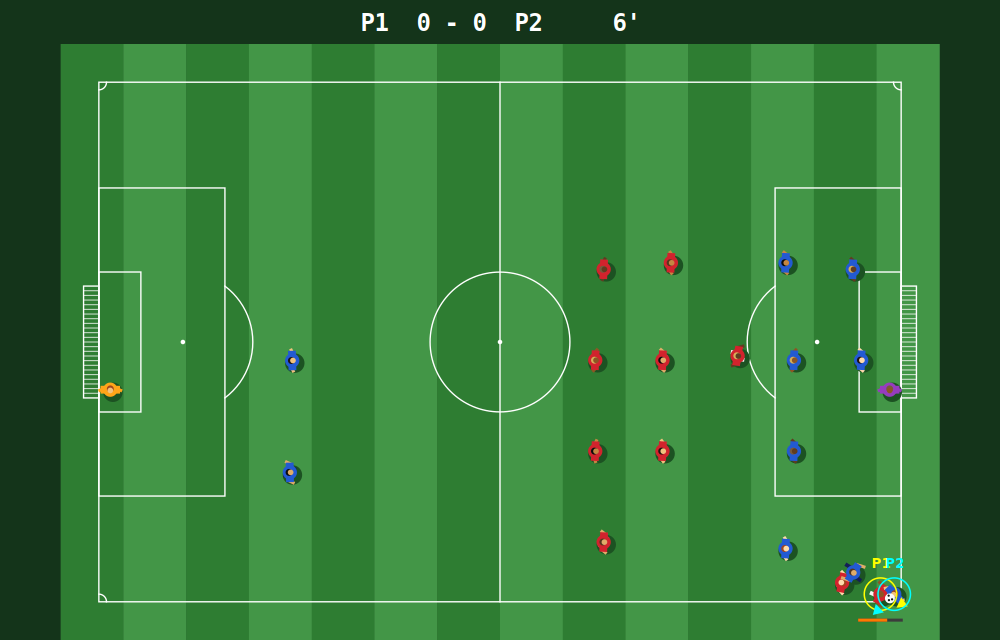

# CAD FIFA

An 11-a-side football game that runs inside AutoCAD.

It uses only the core AutoCAD .NET API, so it works in plain **AutoCAD** and in any product built on it, such as Civil 3D, AutoCAD Architecture, AutoCAD Mechanical, AutoCAD Map 3D and AutoCAD MEP.

| AutoCAD version | Load this DLL |
| --- | --- |
| 2025, 2026 | `net8.0-windows/CadFifa.dll` |
| 2021, 2022, 2023, 2024 | `net48/CadFifa.dll` |

AutoCAD LT can't run it, because LT doesn't support .NET plugins.



*The Window display, rendered offline from the real drawing code with a match in progress.*

## What it does

- Two ways to watch the match:
  - **Drawing** (default): `FIFA` draws a 105 × 68 m pitch into model space and the players run around on it as transient graphics. Each player's animation frames are pre-built as temporary blocks, so each frame AutoCAD only moves about 30 objects. The pitch and blocks are removed when you quit, and nothing goes into your undo history while you play. If it flickers on your graphics card, press M to try other draw modes.
  - **Window**: the match plays in its own resizable window inside AutoCAD instead.
- Each player is a top-down footballer with a shadow, team kit, skin and hair colour, and arms and legs that swing as they run. Tackled players go down. Keepers wear their own kit with long sleeves. The ball spins as it rolls.
- The whole pitch is always in view.
- The game window reads your keyboard and shows the score, clock and controls.
- In Drawing display, quitting erases the pitch again.

## Build

Requirements: Windows and the .NET 8 SDK. The AutoCAD API comes from NuGet, so AutoCAD doesn't need to be installed to build.

```
cd CadFifa
dotnet build -c Release
```

This builds both DLLs:

- `CadFifa/bin/Release/net8.0-windows/CadFifa.dll`
- `CadFifa/bin/Release/net48/CadFifa.dll`

## Run

1. Open AutoCAD and any drawing (a blank one is best).
2. Type `NETLOAD` and pick the DLL for your version from the table above. If AutoCAD shows a security prompt, choose **Load**.
3. Type `FIFA`.
4. Choose a display: **Drawing** (press Enter) or **Window**. For Drawing, also pick a centre point for the pitch, or press Enter for 0,0.
5. Choose a mode:
   - **Solo**: you against the computer.
   - **Versus**: two players on one keyboard. P1 is red, P2 is blue.
   - **Coop**: two players on one keyboard, both red, against the computer.
6. Choose a difficulty: Easy, Normal or Hard. This isn't asked in Versus, which has no computer side.
7. Keep the **CAD FIFA** window focused while you play. Clicking back into the drawing pauses the game.

## Controls

### Solo

| Key | Action |
| --- | --- |
| WASD / arrow keys | Move |
| Shift | Sprint |
| Space or Enter | **With the ball:** hold, then release to shoot. Hold longer for more power; W/S or Up/Down aims high or low in the goal. **Without the ball:** press to slide tackle in the direction you're moving. |
| E | Pass (to the best teammate in the direction you're facing) |
| Q | Switch to the player nearest the ball |

### Two players (Versus and Coop)

| Action | P1 (yellow ring) | P2 (cyan ring) |
| --- | --- | --- |
| Move | W A S D | Arrow keys |
| Sprint | Left Shift | Right Shift |
| Shoot (hold, then release) / slide tackle (press, without the ball) | Space | Enter or Num 0 |
| Pass | E | Right Ctrl or Num 1 |
| Switch player | Q | / or Num 2 |

### Everyone

| Key | Action |
| --- | --- |
| P | Pause |
| M | Drawing display only: change how the players are drawn, if they flicker or disappear on your graphics card. The choice is remembered until AutoCAD closes. |
| R | Restart the match |
| Esc | Quit (and remove the pitch, in Drawing display) |

Slide tackles from the front or side win the ball about 85% of the time when they connect; from behind it's about 55%. Time it: a slide from close range usually works, while diving in from far away usually misses and leaves your player on the ground for a moment.

Some keyboards can't register many keys at once. If a key seems to drop out when you both press several together, try the number-pad keys for P2.

Red attacks to the right and blue to the left. The goals are twice the width of a real goal (14.6 m) for a more open, arcade-style game. A match lasts 4 real minutes, shown as 90'. Throw-ins, corners, goal kicks, keeper saves and kick-offs after goals are all handled.

## Code layout

| File | Purpose |
| --- | --- |
| `Match.cs` | The game engine: physics, rules and AI. It has no AutoCAD dependencies. |
| `Pitch.cs` | Draws the pitch as real lines, arcs and hatches on the `FIFA-PITCH` and `FIFA-GRASS` layers. |
| `Look.cs` | How the footballers look and move (colours, sizes, running animation), shared by both displays. |
| `PitchView.cs` | The Window display: paints the pitch and match into a double-buffered WinForms control. |
| `Renderer.cs` | The Drawing display: pre-builds every animation frame as an anonymous block, then animates one transient block reference per player with `TransientManager`. |
| `GameWindow.cs` | The modeless game window. It runs the game loop, reads the keyboard for one or two players, and hosts the Window display. |
| `Commands.cs` | The `FIFA` command, with its display, mode and difficulty prompts. |
