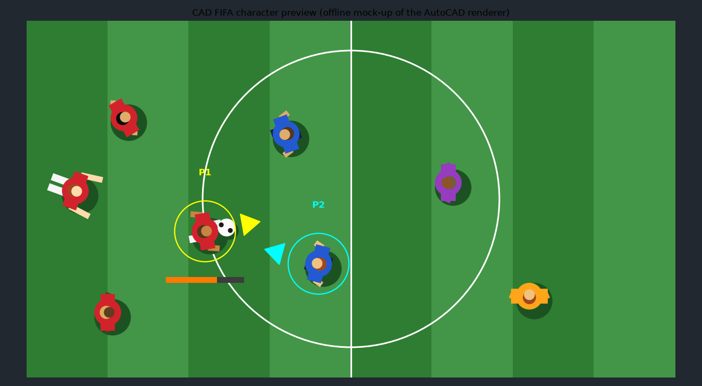

# CAD FIFA

An 11-a-side football game that runs inside AutoCAD.

It uses only the core AutoCAD .NET API, so it works in plain **AutoCAD** and in any product built on it, such as Civil 3D, AutoCAD Architecture, AutoCAD Mechanical, AutoCAD Map 3D and AutoCAD MEP.

| AutoCAD version | Load this DLL |
| --- | --- |
| 2025, 2026 | `net8.0-windows/CadFifa.dll` |
| 2021, 2022, 2023, 2024 | `net48/CadFifa.dll` |

AutoCAD LT can't run it, because LT doesn't support .NET plugins.



*An offline mock-up of how the players are drawn: same shapes, sizes and colours as the in-AutoCAD renderer.*

## What it does

- `FIFA` draws a regulation 105 × 68 m pitch into model space, with mown grass stripes, penalty areas, arcs and goals.
- The players and ball move as transient graphics, so the game never writes to your drawing or undo history while you play.
- Each player is a top-down footballer with a shadow, team kit, skin and hair colour, and arms and legs that swing as they run. Tackled players go down. Keepers wear their own kit with long sleeves. The ball spins as it rolls.
- A broadcast camera follows the ball. Press C to switch to a view of the full pitch.
- A small control window runs the match. It reads your keyboard and shows the score and clock.
- When you quit, the pitch is erased again.

## Build

Requirements: Windows and the .NET 8 SDK. The AutoCAD API comes from NuGet, so AutoCAD doesn't need to be installed to build.

```
cd CadFifa
dotnet build -c Release
```

This builds both DLLs:

- `CadFifa/bin/Release/net8.0-windows/CadFifa.dll`
- `CadFifa/bin/Release/net48/CadFifa.dll`

## Run

1. Open AutoCAD and any drawing (a blank one is best).
2. Type `NETLOAD` and pick the DLL for your version from the table above. If AutoCAD shows a security prompt, choose **Load**.
3. Type `FIFA`.
4. Pick a centre point for the pitch, or press Enter for 0,0.
5. Choose a mode:
   - **Solo**: you against the computer.
   - **Versus**: two players on one keyboard. P1 is red, P2 is blue.
   - **Coop**: two players on one keyboard, both red, against the computer.
6. Choose a difficulty: Easy, Normal or Hard. This isn't asked in Versus, which has no computer side.
7. Keep the **CAD FIFA** window focused while you play. Clicking back into the drawing pauses the game.

## Controls

### Solo

| Key | Action |
| --- | --- |
| WASD / arrow keys | Move |
| Shift | Sprint |
| Space or Enter (hold, then release) | Shoot. Hold longer for more power; W/S or Up/Down aims high or low in the goal. Without the ball, it tackles. |
| E | Pass (to the best teammate in the direction you're facing) |
| Q | Switch to the player nearest the ball |

### Two players (Versus and Coop)

| Action | P1 (yellow ring) | P2 (cyan ring) |
| --- | --- | --- |
| Move | W A S D | Arrow keys |
| Sprint | Left Shift | Right Shift |
| Shoot / tackle (hold, then release) | Space | Enter or Num 0 |
| Pass | E | Right Ctrl or Num 1 |
| Switch player | Q | / or Num 2 |

### Everyone

| Key | Action |
| --- | --- |
| C | Camera: follow the ball, or show the full pitch |
| P | Pause |
| R | Restart the match |
| Esc | Quit and remove the pitch |

Some keyboards can't register many keys at once. If a key seems to drop out when you both press several together, try the number-pad keys for P2.

Red attacks to the right and blue to the left. A match lasts 4 real minutes, shown as 90'. Throw-ins, corners, goal kicks, keeper saves and kick-offs after goals are all handled.

## Code layout

| File | Purpose |
| --- | --- |
| `Match.cs` | The game engine: physics, rules and AI. It has no AutoCAD dependencies. |
| `Pitch.cs` | Draws the pitch as real lines, arcs and hatches on the `FIFA-PITCH` and `FIFA-GRASS` layers. |
| `Renderer.cs` | Draws the animated footballers, ball, player markers and scoreboard with `TransientManager`. |
| `GameWindow.cs` | The modeless WinForms window. It runs the game loop, reads the keyboard for one or two players, and moves the camera. |
| `Commands.cs` | The `FIFA` command, with its mode and difficulty prompts. |
