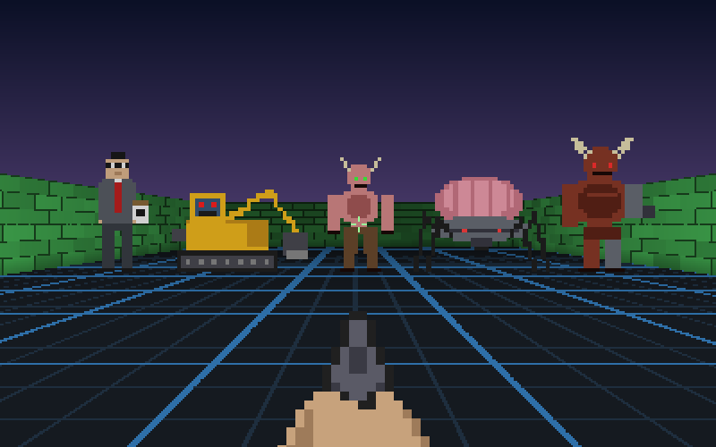
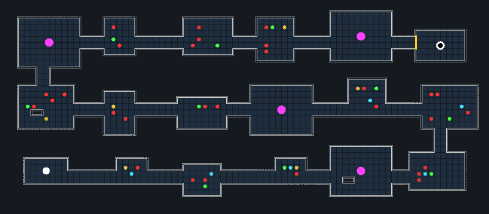
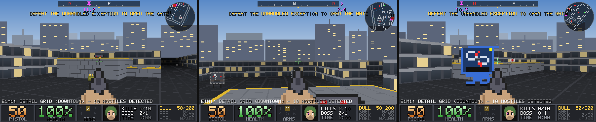
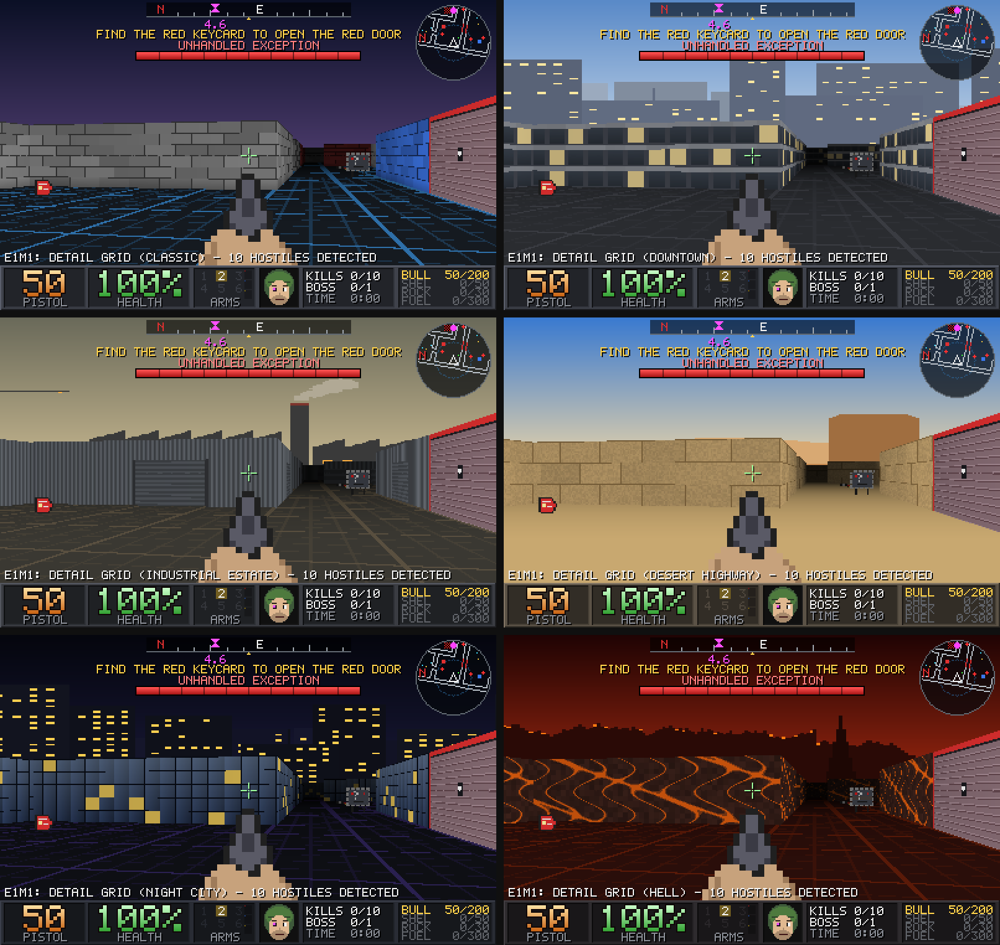
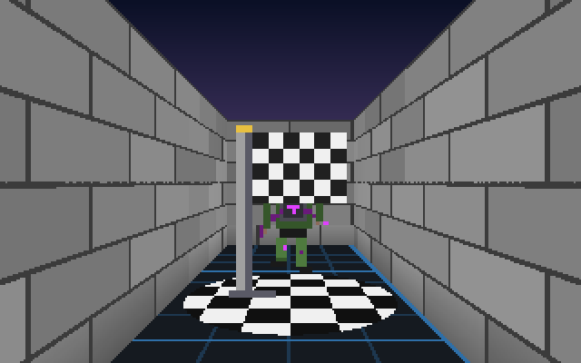
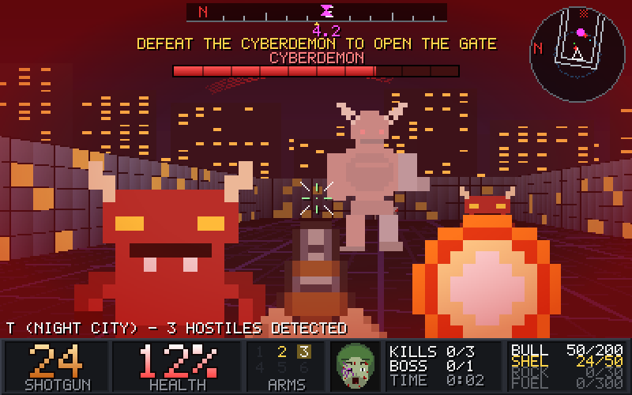
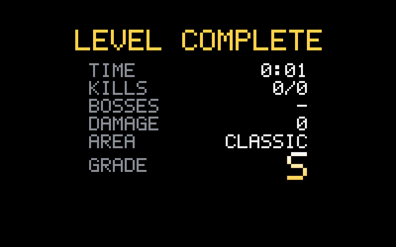
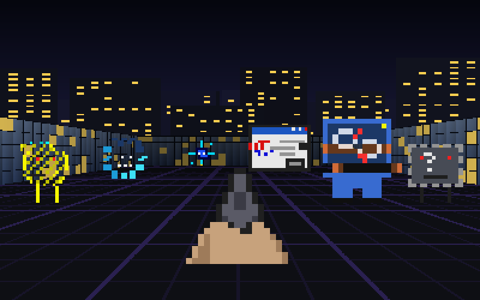

# CivDOOM

A Doom-style first-person shooter that runs **inside Civil 3D**. Type `CIVDOOM` and the linework in
your drawing — lines, polylines, arcs, blocks, alignments, feature lines, parcels — becomes the walls
of a level, and the AutoCAD viewport itself turns into the game: the camera walks through your
drawing in perspective while you shoot imps in it.

`CIVDOOMGEN` draws a random level into the drawing as ordinary polylines and blocks, so you can edit
the level with normal drafting commands before playing it.


## How it works

* **Walls come from your drawing.** Every curve becomes a full-height wall, textured with its
  entity/layer colour. Blocks and Civil 3D objects (alignments, feature lines, parcels, survey
  figures) are exploded *in memory* — the drawing itself is never modified.
* **Enemies come from points.** Any `POINT` or COGO point becomes an enemy spawn (every fifth is a
  tougher Brute). If the drawing has none, enemies and pickups are auto-placed in the areas you can
  actually walk to.
* **The floor is a CAD grid.** One major grid line per wall-height, which makes it easy to judge scale.
* The engine is a software ray caster that works on arbitrary line segments (not a tile grid), with a
  spatial index so a 50,000-segment site plan still renders in ~3 ms per frame.

## Objectives: bosses, gates and the finish line



Levels can have a **finish line** (`DOOM-EXIT`). It sits behind a **locked gate** (any linework on the
`DOOM-GATE` layer, drawn with yellow/black hazard stripes) that opens when the bosses are beaten:
`DOOM-EXIT` needs **all** bosses dead, `DOOM-EXIT-FINAL` only the **final** boss (the one nearest the
finish). Walking onto the open finish line wins. Without a finish line, the old rule applies (kill everything).

Five bosses ship as monster files with `boss = yes` — The Blue Screen, Infinite Regen, The Corrupted DWG,
Unhandled Exception and Licence Expired. Bosses never appear as random monsters; `DOOM-BOSS` places a random
one, and each fight in a level gets a different boss. They can fire several shots per attack (`shots`,
`shot spread`, `shot color`). The HUD shows the current objective and a boss health bar.

### Generated levels



`CIVDOOMGEN` builds a **linear** level — start, rooms, boss arena, rooms, boss arena, …, gated finish
room — with straight corridors and no way around an arena. Small levels have 1–2 boss fights, Medium
2–3 and Large 4–5. Walls are closed polylines with one constant thickness (a double line; set the
thickness when generating, 0 for single lines) and one wall height for the whole level.

## Vertical areas: ledges, balconies and towers



Levels can have raised floors you **jump** up onto (`Space`). A jump lifts you a bit over half a wall
height; low steps (under 0.16 of a wall) you just walk up, like stairs. You can walk off any edge.

* **Balconies** run along a room's wall, 0.4 of a wall high: jump up to grab the prize on them.
* **Stepped towers** are three jumps (0.2, 0.4, 0.6) with a weapon or item on top.
* **Boss arenas** get raised corners: high ground to fight from.
* Items up on a ledge can only be picked up from the top.
* Walking monsters can't climb ledges (fliers float over them), so high ground is safe from melee —
  but not from fireballs, which aim up and down at you. Your rockets and flames aim up and down too.

In a drawing, a platform is a **closed polyline (or circle) on the `DOOM-PLATFORM` layer**. Its
**Elevation** is the height of the top in drawing units, measured from the `DOOM-START` block's Z
(with 10-unit walls, elevation 4 is a jump-up ledge; 1.5 is a step). Overlapping platforms stack: the
highest one wins. `CIVDOOMGEN` draws its platforms this way, so you can `STRETCH`, `MOVE` or change the
elevation of them in Properties like anything else.

## Areas (themes)



Each level has an area: **Classic**, **Downtown** (office towers and a skyline), **Industrial Estate**
(corrugated sheds, chimneys, cranes), **Desert Highway** (sandstone and mesas), **Night City** (glass towers,
lit windows) or **Hell**. The walls become building facades and a 360° skyline turns with you.
`CIVDOOMGEN` picks one at random; `CIVDOOMTHEME` changes it. The choice is a `DOOM-THEME-<NAME>` block in
the drawing (no block = Classic). Themes are editable folders (`themes\city\city.txt`), with optional
`skyline.png` and `wall.png` pictures.

## The finish-line cutscene



Cross the open finish line and the camera pulls back while your **corrupted marine** sprints off the
map, then a LEVEL COMPLETE card shows your time, kills, bosses and damage taken. The character is
editable too (`player\player.txt`, or `player.png` with `player_run`/`player_run2` frames).

## The HUD



Pixel-art, Doom style: a status bar with big ammo and health numbers, ARMS slots, kills/bosses/time,
ammo stock by type and a live **corrupted-marine face** (looks toward whoever hit you, grins at kills and
pickups, bloodier and more corrupted as health drops). Up top: a compass with an objective marker and
distance, a rotating radar, and a boss bar with trailing damage. In combat: a dynamic crosshair, hit and
kill markers, directional damage arcs and a low-health vignette. Plus a message feed, weapon popup,
a "killed by" death screen and a graded level-complete card. `H` hides the HUD, `Tab` the radar.



## Commands

| Command | What it does |
| --- | --- |
| `CIVDOOM` | Play the drawing. Choose **Viewport** (inside the AutoCAD drawing window) or **Window** (a separate game window). |
| `CIVDOOMWINDOW` | The original pop-out version: same level options and weapons, always in its own game window (smoothest, with minimap). |
| `CIVDOOMGEN` | Draw a random level (Small/Medium/Large) as editable objects: closed polylines on `DOOM-WALLS`, plus marker blocks. |
| `CIVDOOMTHEME` | Choose (or randomise) the area the drawing's level looks like. |
| `CIVDOOMBLOCKS` | Add all the `DOOM-*` marker blocks to the drawing so you can `INSERT` them yourself. |

### Level markers

Ordinary blocks whose names say what they are — move, copy, rotate or erase them like anything else:

| Block | Meaning |
| --- | --- |
| `DOOM-START` | Where you spawn. Its rotation is the way you face; its scale is used as the default wall height. |
| `DOOM-MONSTER-IMP`, `DOOM-MONSTER-BRUTE`, … | A specific monster (one block per monster file). `DOOM-MONSTER` = random. |
| `DOOM-WEAPON-SHOTGUN`, … | A specific weapon (one per weapon file). `DOOM-WEAPON` = any. |
| `DOOM-HEALTH`, `DOOM-AMMO` | Medkit, ammo box. |

Layers: linework on `DOOM-GATE` is a locked gate; closed polylines on `DOOM-PLATFORM` are raised floors
(elevation = height); everything else is a wall.

If a drawing has no monster/item/weapon markers, those are placed automatically. You can redefine the
blocks' appearance freely; only the names matter.

### Playing in the viewport

Walls are shown as temporary 3D faces standing on your linework (the drawing is never modified), the
viewport switches to a perspective *Realistic* view that follows you, and monsters, items and your gun
are drawn as pixel billboards. Health and ammo appear as bars at the bottom of the view and in the
status bar; messages go to the command line. Keyboard and mouse are captured while you play, and `Esc`
restores your original view. This mode is experimental: expect a lower frame rate than the window mode
on big drawings.

## Using it

1. Build (see below), then in Civil 3D run `NETLOAD` and pick
   `src/CivDoom.Civil3D/bin/Release/net8.0-windows/CivDoom.Civil3D.dll`
   (or install the autoloader bundle, below).
2. Run **`CIVDOOM`** and answer the prompts:

   | Prompt | Meaning |
   | --- | --- |
   | `Level source [Drawing/Selection/Demo]` | **Drawing**: everything in model space on visible layers. **Selection**: only what you pick. **Demo**: a built-in level. |
   | `Wall height in drawing units` | Sets the scale. Default is guessed from `INSUNITS` (10 for feet, 3 for metres, …). Bigger = you feel smaller. |
   | `Pick player start` / `Pick a point to face` | Where you spawn and which way you look. Enter to use the middle of the drawing, facing east. |

### Controls

| | |
| --- | --- |
| `W` `A` `S` `D` / arrows | Move / strafe / turn |
| Mouse | Turn (click the window first to capture the mouse) |
| Left click / `Ctrl` | Fire |
| `Space` | Jump |
| `1`–`9` / mouse wheel | Switch weapon (press a number again to cycle weapons sharing it) |
| `Shift` | Run |
| `Tab` / `M` | Toggle minimap |
| `Enter` | Restart after winning or dying |
| `F5` | Reload the monster and weapon files |
| `Esc` | Release the mouse, press again to return to Civil 3D |

Clear every hostile to win. Medkits heal 25, ammo boxes give 20 rounds.

**Tips:** floor plans and building footprints make the best levels. On a large site plan use
*Selection* to pick one area, and put down a few `POINT`s where you want enemies.

## Weapons

You start with the pistol; the rest are lying around the level (in drawings, one of each is placed
automatically).

| Key | Weapon | |
| --- | --- | --- |
| 1 | Chainsaw / Katana | Melee, never run out. The katana sweeps everything in front of you. |
| 2 | Pistol | |
| 3 | Shotgun | 7 pellets per shot |
| 4 | Chaingun | Very fast |
| 5 | Rocket Launcher | Splash damage — including to you |
| 6 | Flamethrower | Short-range stream of fire |

Weapons are editable text files too (in a `weapons` folder next to the plugin), in the same format
as monsters: stats at the top, then `[colors]` and the `[hand]`, `[fire]`, `[pickup]` and
`[projectile]` pictures. Copy a file to add a new weapon.

## Designing monsters



The monsters are **glitches from the drawing itself**: Proxy Object, Unresolved Xref, Fatal Error (floats),
Stray Vertex (a tiny, fast, floating grip), Not Responding (a spinning busy wheel) and Rogue Hatch — plus the
five bosses above. They visibly glitch on screen (rows tear and colours flicker; the `glitch` setting, 0–1).

Every monster is a plain text file in its own folder (`monsters\imp\imp.txt`) next to the plugin DLL (created with the
imp and brute the first time the game runs). Open one in Notepad, change it, save, and press **F5**
in the game to see the result immediately.

```
name   = Imp
health = 50        # stats: health, speed, size, damage, fireball speed, attack delay, spawn weight
[colors]
R = A8322A         # one letter = one colour; "." is see-through
[idle]             # also [walk], [attack], [dead]
...RRRRRRRRRR...
```

* **New monster:** copy `imp.txt` to a new name (e.g. `cacodemon.txt`). It joins the random spawns
  according to its `spawn weight`.
* **Remove a monster:** delete its file. **Start over:** delete the `monsters` folder.
* Mistakes never crash the game: a message in the game window names the file and line to fix, and
  a broken built-in file falls back to the original.

### Using PNG or JPEG pictures

Put `imp.png` (or `.jpg`/`.jpeg`) in the `imp` folder next to `imp.txt` and it replaces the character art. Optional extra
frames are `imp_walk`, `imp_attack` and `imp_dead`; missing ones are generated (mirrored, glowing,
squashed). Transparent PNGs work best; otherwise the background colour touching the edges is removed.
Pictures are trimmed and shrunk to `image size` pixels (default 64). Weapons work the same way
(`shotgun.png`, `shotgun_fire`, `shotgun_pickup`, `shotgun_projectile`).

The shipped designs live in `src/CivDoom.Engine/Monsters/` and are embedded in the engine DLL.

## Building

Requires Windows and the .NET 8 SDK. Targets **Civil 3D 2025 and later** (and any other AutoCAD
2025+ product, since AutoCAD moved to .NET 8 in 2025). No Autodesk install is needed to build: the
AutoCAD reference assemblies come from the `AutoCAD.NET` NuGet package.

```
dotnet build CivDoom.sln -c Release
dotnet test tests/CivDoom.Engine.Tests
```

To try the game without Civil 3D, run `src/CivDoom.Sandbox` (`dotnet run --project src/CivDoom.Sandbox`).

### Autoloader bundle

Building copies the plugin DLLs into `bundle/CivDoom.bundle/Contents/`. Copy the whole
`CivDoom.bundle` folder into `%APPDATA%\Autodesk\ApplicationPlugins\` and restart Civil 3D;
`CIVDOOM` will then be available without `NETLOAD`. CI also publishes the bundle as a build artifact.

## Project layout

| Project | What it is |
| --- | --- |
| `src/CivDoom.Engine` | The game: level building, ray casting, collision, AI, renderer. Pure .NET, no Autodesk or UI dependencies. |
| `src/CivDoom.Windows` | The WinForms game window (input, game loop, HUD). |
| `src/CivDoom.Civil3D` | The plugin: the `CIVDOOM` command and the drawing → level extractor. |
| `src/CivDoom.Sandbox` | Standalone launcher for the built-in level. |
| `tests/CivDoom.Engine.Tests` | xUnit tests for the engine. |

Item and weapon sprites are character art in `Sprites.cs`; monsters are the text files above. There are no binary assets.
