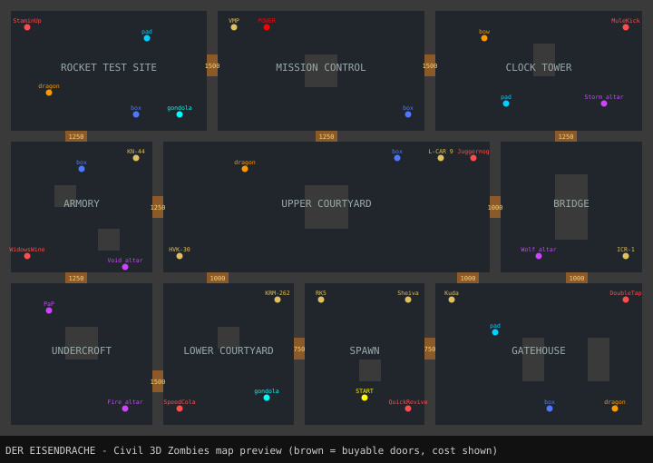

# Der Eisendrache — Call of Duty Zombies in Civil 3D 2026

A round-based zombies survival game that runs **inside an AutoCAD Civil 3D 2026 drawing**,
loosely based on the Black Ops III map *Der Eisendrache*. Play it top-down on the site plan
(`DERZOMBIES`) or **in first person, walking through the castle in 3D** (`DERZ3D`). The castle is drafted into model space
as real drawing objects, with a Civil 3D TIN surface for the mountain and COGO points on every
machine. Zombies, bullets and the HUD are drawn live with AutoCAD transient graphics.



> Fan project for fun. It is not affiliated with Activision or Treyarch and uses no game assets:
> the map is a simplified re-imagining, and the weapon stats are hand-tuned approximations.

## What's in it

| Der Eisendrache feature | In the drawing |
|---|---|
| 10 castle areas: Spawn, Lower/Upper Courtyard, Gatehouse, Armory, Bridge, Undercroft, Mission Control, Rocket Test Site, Clock Tower | Walls, solid wall fill and area labels on `DE-*` layers |
| Buyable doors (750–1500) | Crossed-out rectangles that get erased from the DWG when you buy them |
| Rounds with walkers, runners and sprinters; zombie health and counts scale each round | Zombies pathfind around walls and through any doors you've opened |
| Panzer Soldat (round 8 and then every 4–6 rounds) | Armoured boss with a flamethrower and a health bar; drops a Max Ammo |
| Power switch (Mission Control) | Perks need power, except Quick Revive |
| Perks: Juggernog, Quick Revive, Speed Cola, Double Tap, Stamin-Up, Mule Kick, Widow's Wine (4-perk limit) | Coloured machines with prices |
| 3 landing pads → Pack-a-Punch (Undercroft) | Pack-a-Punch costs 5000: 2.5× damage, bigger mag and reserve, extra pierce |
| Wall-buys: RK5, Sheiva, L-CAR 9, Kuda, KN-44, KRM-262, HVK-30, VMP, ICR-1 | Buy the gun again to refill its ammo for half price |
| Mystery Box (950) with the Ray Gun and BO3 box weapons; the teddy bear moves it | 5 possible box locations |
| Gondola between the Lower Courtyard and the Rocket Test Site | Needs power; 20 s cooldown |
| Feed the 3 dragons (kill zombies near them) → **Wrath of the Ancients** bow from the Clock Tower pedestal | Each dragon shows its range ring and a soul counter |
| Bow upgrades at 4 altars (10 bow kills each): **Storm** (chain lightning), **Fire** (burning ground), **Void** (vortex), **Wolf** (spirit wolf) | One upgrade per bow |
| Power-ups: Max Ammo, Insta-Kill, Double Points, Kaboom (nuke), Fire Sale | They blink before they expire |
| Grenades, knife, self-revive with Quick Revive (up to 3 times) | |

## Two ways to play

| | `DERZOMBIES` (plan view) | `DERZ3D` (first person) |
|---|---|---|
| Castle | 2D linework, wall fill and labels, like a site plan | 3D solids: 14' walls with battlements, stone floors per area, barricades, machines |
| Camera | Top-down, zoomed to the whole castle | Perspective camera at eye height, moved every frame |
| Aim | Mouse cursor (or Left/Right) | Mouse look, with the cursor locked to the window (or Left/Right to turn) |
| Movement | WASD = north/west/south/east | WASD = forward/strafe, relative to where you're looking |
| Zombies | Coloured circles | 3D bodies and heads; the Panzer Soldat is big, with a floating health bar |
| HUD | Text above the map | Pinned in front of the camera: round number, points, ammo, perks, crosshair, a gun, and a red border when you're hurt |
| Terrain | Mountain surface around a 300' plateau | Mountain surface falling away below the castle walls |

`DERZ3D` switches the viewport to the *Shaded* visual style, turns off view-transition animation,
the UCS icon, ViewCube and rollover tips while you play, and puts all of them back when you quit.

## Controls

| Key | Action |
|---|---|
| `W` `A` `S` `D` (or arrow up/down) | Move (in first person: forward, back and strafe) |
| Mouse (or arrow left/right) | Aim / look |
| Left click / `Space` / `F` | Fire (hold for automatic weapons; click again for semi-auto) |
| `R` | Reload |
| `Q` | Swap weapon |
| `E` | Buy / use (doors, perks, wall-buys, box, power, pads, Pack-a-Punch, gondola, bow) |
| `V` / right click | Knife |
| `G` | Grenade |
| `Tab` | First person: free the mouse cursor / lock it again |
| `P` | Pause (the game also pauses when Civil 3D isn't the active window) |
| `Esc` | Quit |
| `Enter` | Play again after game over |

While the game is running it swallows those keys and the mouse buttons, so AutoCAD doesn't select
or run commands. Press `Esc` to get control back.

## Build and run

You need the **.NET 8 SDK**. Civil 3D does **not** have to be installed to build: the AutoCAD and
Civil 3D APIs come from Autodesk's official NuGet reference packages (`AutoCAD.NET` 25.1.0 and
`Civil3D.NET` 13.8.280, the 2026 releases). They are compile-only, so Civil 3D supplies the real DLLs
at run time.

```powershell
git clone <this repo>
cd Detail_Grid
dotnet build src/DerZombies.Civil3D -c Release
```

The output is a single file, `src\DerZombies.Civil3D\bin\Release\net8.0-windows\DerZombies.Civil3D.dll`.
The game engine is compiled into it.

In Civil 3D:

1. Start a **new, empty drawing**. The castle is drawn at 0,0 on `DE-*` layers.
2. Run `NETLOAD` and pick `src\DerZombies.Civil3D\bin\Release\net8.0-windows\DerZombies.Civil3D.dll`.
3. Run **`DERZ3D`** for first person or **`DERZOMBIES`** for top-down, then click once in the drawing so it has focus.

### Commands

| Command | What it does |
|---|---|
| `DERZOMBIES` | Draws the castle, the Civil 3D surface and points, zooms to it and starts a top-down game |
| `DERZ3D` | Builds the castle in 3D, plus the Civil 3D mountain surface, and starts a first-person game |
| `DERZQUIT` | Stops the game (same as `Esc`) |
| `DERZMAP` | Draws the castle, surface and points without playing, e.g. to plot the "site plan" |
| `DERZCLEAN` | Erases everything on the `DE-*` layers |

## How it works

```
src/DerZombies.Core      Pure C# game engine (no Autodesk references), unit tested
  MapData.cs             The castle as a 60x40 ASCII grid + doors, perks, wall-buys, quest features
  GameMap.cs             Walkability, doors, line of sight, BFS flow field for zombie pathing
  Game.cs                Rounds, spawning, AI, weapons, perks, box, Pack-a-Punch, dragons, bow, power-ups
  Weapons.cs / Entities.cs
src/DerZombies.Civil3D   The Civil 3D 2026 plugin
  Commands.cs            DERZOMBIES / DERZQUIT / DERZMAP / DERZCLEAN
  MapBuilder.cs          Plan mode: writes walls, doors, labels, machines and a title block into model space
  MapBuilder3D.cs        First person: the castle as Solid3d walls, floors, barricades and machines
  CivilSite.cs           TIN surface "DE - Eisendrache Mountain" + COGO points on the machines
  Renderer.cs            Plan mode: transient graphics for the player, zombies, effects and HUD (nothing saved to the DWG)
  Renderer3D.cs          First person: perspective camera, 3D transient zombies, billboard labels, camera-locked HUD
  GameSession.cs         Frame loop (WinForms timer), GetAsyncKeyState input, PointMonitor aiming
tests/DerZombies.Tests   xUnit tests for the engine (map integrity, doors, perks, PaP, box, bow quest, a bot run)
tools/render_map_svg.py  Regenerates docs/map-preview.svg from MapData.cs
```

To change the map, edit the ASCII layout in `MapData.cs`: `#` is a wall, capital letters are areas,
and digits or lowercase letters are doors. Then run the tests and `python tools/render_map_svg.py`.

Run the engine tests on any OS:

```bash
dotnet test tests/DerZombies.Tests
```

## Status

- The engine's 16 tests pass, including a bot that buys a wall gun and survives the early rounds.
- The plugin builds with no warnings against Autodesk's AutoCAD 2026 and Civil 3D 2026 reference assemblies.
- It has **not been run inside Civil 3D 2026 yet**. If anything misbehaves at run time (most likely
  the input hook, the transient refresh, or the surface and COGO calls), please report it. In first
  person, the frame rate depends on how fast Civil 3D can redraw a shaded perspective view; the
  camera is moved with `Editor.SetCurrentView` every frame. The
  Civil 3D surface and points are wrapped so that a failure there won't stop the game.
