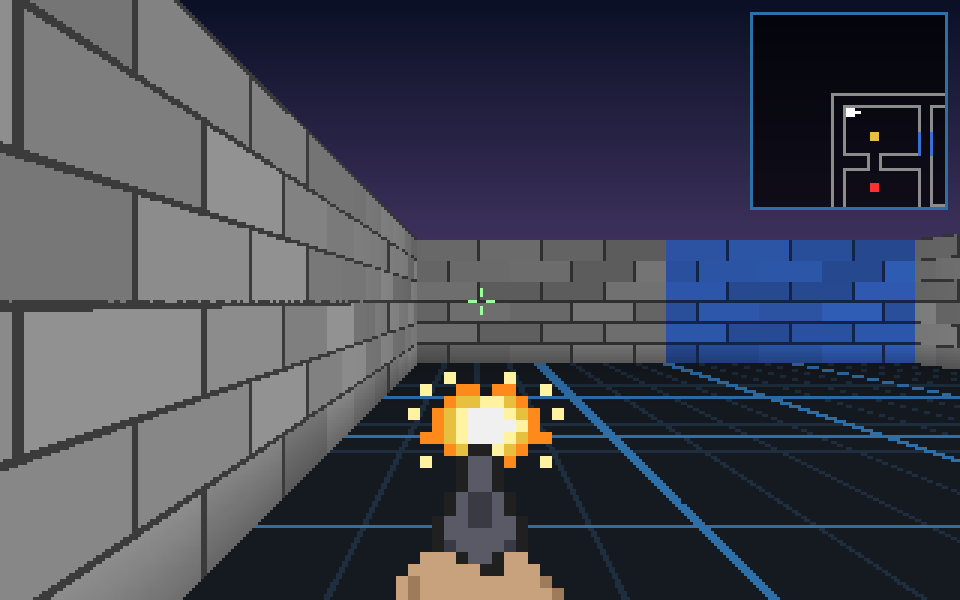
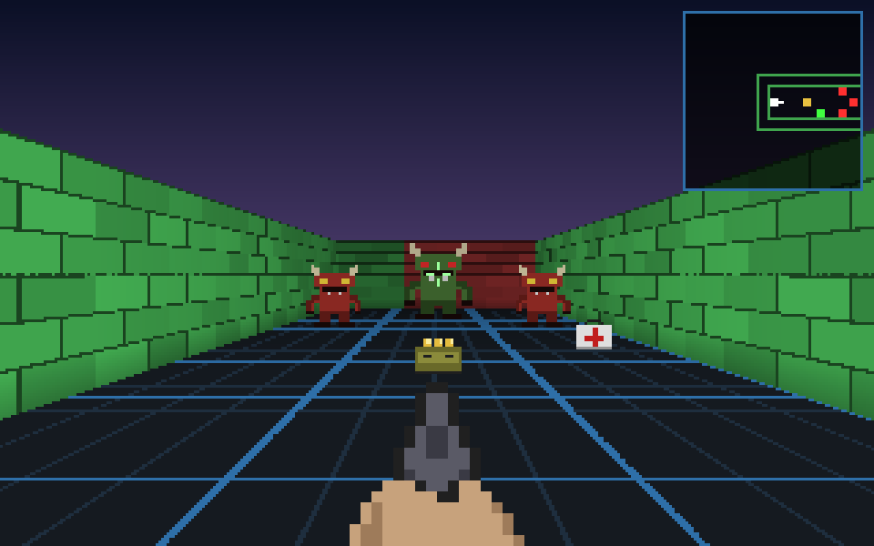

# CivDOOM

A Doom-style first-person shooter that runs **inside Civil 3D**. Type `CIVDOOM` and the linework in
your drawing — lines, polylines, arcs, blocks, alignments, feature lines, parcels — becomes the walls
of a level. Then you get to shoot imps in it.




## How it works

* **Walls come from your drawing.** Every curve becomes a full-height wall, textured with its
  entity/layer colour. Blocks and Civil 3D objects (alignments, feature lines, parcels, survey
  figures) are exploded *in memory* — the drawing itself is never modified.
* **Enemies come from points.** Any `POINT` or COGO point becomes an enemy spawn (every fifth is a
  tougher Brute). If the drawing has none, enemies and pickups are auto-placed in the areas you can
  actually walk to.
* **The floor is a CAD grid.** One major grid line per wall-height, which makes it easy to judge scale.
* The engine is a software ray caster that works on arbitrary line segments (not a tile grid), with a
  spatial index so a 50,000-segment site plan still renders in ~3 ms per frame.

## Using it

1. Build (see below), then in Civil 3D run `NETLOAD` and pick
   `src/CivDoom.Civil3D/bin/Release/net8.0-windows/CivDoom.Civil3D.dll`
   (or install the autoloader bundle, below).
2. Run **`CIVDOOM`** and answer the prompts:

   | Prompt | Meaning |
   | --- | --- |
   | `Level source [Drawing/Selection/Demo]` | **Drawing**: everything in model space on visible layers. **Selection**: only what you pick. **Demo**: a built-in level. |
   | `Wall height in drawing units` | Sets the scale. Default is guessed from `INSUNITS` (10 for feet, 3 for metres, …). Bigger = you feel smaller. |
   | `Pick player start` / `Pick a point to face` | Where you spawn and which way you look. Enter to use the middle of the drawing, facing east. |

### Controls

| | |
| --- | --- |
| `W` `A` `S` `D` / arrows | Move / strafe / turn |
| Mouse | Turn (click the window first to capture the mouse) |
| Left click / `Space` / `Ctrl` | Fire |
| `Shift` | Run |
| `Tab` / `M` | Toggle minimap |
| `Enter` | Restart after winning or dying |
| `Esc` | Release the mouse, press again to return to Civil 3D |

Clear every hostile to win. Medkits heal 25, ammo boxes give 20 rounds.

**Tips:** floor plans and building footprints make the best levels. On a large site plan use
*Selection* to pick one area, and put down a few `POINT`s where you want enemies.

## Building

Requires Windows and the .NET 8 SDK. Targets **Civil 3D 2025 and later** (and any other AutoCAD
2025+ product, since AutoCAD moved to .NET 8 in 2025). No Autodesk install is needed to build: the
AutoCAD reference assemblies come from the `AutoCAD.NET` NuGet package.

```
dotnet build CivDoom.sln -c Release
dotnet test tests/CivDoom.Engine.Tests
```

To try the game without Civil 3D, run `src/CivDoom.Sandbox` (`dotnet run --project src/CivDoom.Sandbox`).

### Autoloader bundle

Building copies the plugin DLLs into `bundle/CivDoom.bundle/Contents/`. Copy the whole
`CivDoom.bundle` folder into `%APPDATA%\Autodesk\ApplicationPlugins\` and restart Civil 3D;
`CIVDOOM` will then be available without `NETLOAD`. CI also publishes the bundle as a build artifact.

## Project layout

| Project | What it is |
| --- | --- |
| `src/CivDoom.Engine` | The game: level building, ray casting, collision, AI, renderer. Pure .NET, no Autodesk or UI dependencies. |
| `src/CivDoom.Windows` | The WinForms game window (input, game loop, HUD). |
| `src/CivDoom.Civil3D` | The plugin: the `CIVDOOM` command and the drawing → level extractor. |
| `src/CivDoom.Sandbox` | Standalone launcher for the built-in level. |
| `tests/CivDoom.Engine.Tests` | xUnit tests for the engine. |

All sprites are drawn as character art in `Sprites.cs` — there are no binary assets.
