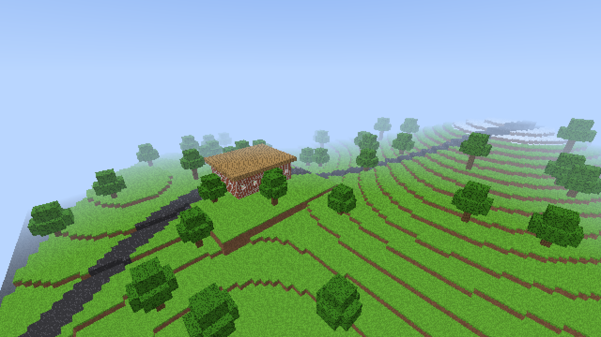

# BlockCraft for Civil 3D

Minecraft-style block terrain built **directly in model space** in Autodesk
Civil 3D. You can generate it from random noise or from one of your surfaces
(alignments become asphalt roads). Every visible block is an ordinary block
reference snapped to a grid, so you can edit the terrain with BlockCraft's
commands or with normal drafting commands. When you're done, BCTOSURFACE turns
the result back into a TIN surface.



*Rendered with the optional game-window renderer. The terraces are the
surface's contours, the road follows an alignment, and the house was built
from placed blocks.*

## Commands

| Command | What it does |
| --- | --- |
| `BLOCKCRAFT` | Lists the commands. |
| `BCNEW` | Generates a procedural world in model space. Asks for a seed, the world size (16-256 blocks), the block size, and the south-west corner point. |
| `BCSURFACE` | Pick a TIN or grid surface to build a world from it. Asks for the block size, the vertical exaggeration, and whether to pave alignments as roads. |
| `BCBREAK` | Select blocks (window and crossing selections work) to dig them out. The blocks underneath are drawn as they are exposed. |
| `BCPLACE` | Pick blocks to build onto. `Type` sets the block material. `Direction` is either `Auto` (the face pointing at you) or `Top`/`Bottom`/`North`/`South`/`East`/`West`. |
| `BCSYNC` | Run this after `ERASE`, `COPY`, `MOVE` or `ARRAY` on `BC_*` blocks. It reads those edits back into the world and draws any blocks that are newly exposed. |
| `BCWALK` | Sets a perspective camera at ground level, then starts AutoCAD's `3DWALK`. |
| `BCPLAY` | Optional. Plays the drawing's world in the first-person game window, and writes your changes back to the drawing when you close it. |
| `BCTOSURFACE` | Creates a Civil 3D TIN surface from the top of each block column. Trees and water are ignored. |
| `BCCLEAR` | Removes the world and all of its blocks from the drawing. |

### How it's stored

* A drawing holds one world. The full voxel grid is saved, compressed, in the
  drawing's named object dictionary. It survives saving and reopening the DWG,
  and it follows `UNDO`.
* Only the visible shell is drawn: about 15,000 block references for the
  default 96 × 96 world, and about 58,000 at 192 × 192. Buried blocks stay as
  data until you dig down to them.
* Each block type is a 1 × 1 × 1 block definition (`BC_GRASS`, `BC_STONE`,
  ...). Its references are scaled to the cell size and placed on a
  `BLOCKCRAFT-<TYPE>` layer.
* A reference belongs to whichever voxel its insertion point is nearest.
  When you copy or move blocks, snap to their corners (Endpoint osnap) so
  they land on the grid.

## Game window controls (BCPLAY)

| Input | Action |
| --- | --- |
| Click | Capture the mouse and start playing |
| W A S D / arrows | Move |
| Mouse | Look |
| Space | Jump (or go up while flying) |
| Shift | Go down while flying |
| Ctrl | Sprint |
| F | Toggle flying |
| Left click (hold) | Break a block |
| Right click (hold) | Place a block |
| Middle click | Pick the block you're looking at |
| 1-9 / mouse wheel | Choose a block |
| + / - | Raise or lower render quality |
| F1 | Show or hide help |
| Esc | Release the mouse, then press again to return to the drawing |

## Build and install

Requirements: Civil 3D 2025 or 2026 (both run on .NET 8) and the .NET 8 SDK on
Windows. The Autodesk API assemblies come from Autodesk's official
`AutoCAD.NET` and `Civil3D.NET` NuGet packages. They're only needed to
compile and are never copied to the output.

```powershell
dotnet build BlockCraft.sln -c Release
```

The build creates an autoloader bundle at
`src\BlockCraft.Civil3D\bin\Release\net8.0-windows\BlockCraft.bundle`.
To install it, copy that folder to
`%APPDATA%\Autodesk\ApplicationPlugins\` and restart Civil 3D. You can also
`NETLOAD` the `BlockCraft.Civil3D.dll` file inside `Contents\`.

In plain AutoCAD 2025/2026, everything except `BCSURFACE` and `BCTOSURFACE`
works. Those two need Civil 3D.

You can also play without Civil 3D:

```powershell
dotnet run --project src\BlockCraft.Standalone -- 1234   # optional seed
```

## Project layout

| Project | Contents |
| --- | --- |
| `src/BlockCraft.Core` | Engine with no UI or Autodesk dependencies: voxel world, terrain generation, player physics, block ray casting, and a multi-threaded software ray-cast renderer. No GPU is needed, so there is no DirectX or OpenGL conflict inside Civil 3D. |
| `src/BlockCraft.UI` | WinForms game window: game loop, mouse-look, input handling, and the HUD. |
| `src/BlockCraft.Civil3D` | Civil 3D commands, the drawing-backed world (storage, block references, sync), surface and alignment sampling, and TIN surface output. |
| `src/BlockCraft.Standalone` | Launches the game on its own, outside Civil 3D. |
| `tests/BlockCraft.Core.Tests` | xUnit tests for the engine. |

## Notes and limits

* `3DWALK` doesn't follow the ground. Use the mouse wheel or `3DFLY` to change
  height, or use `BCPLAY` for a walk with gravity and collisions.
* Surface worlds are limited to 256 × 256 columns and 256 layers. If your
  inputs would exceed that, the block size or vertical scale is adjusted
  automatically and the command tells you.
* Any command that would draw more than 120,000 blocks asks you to confirm
  first.
